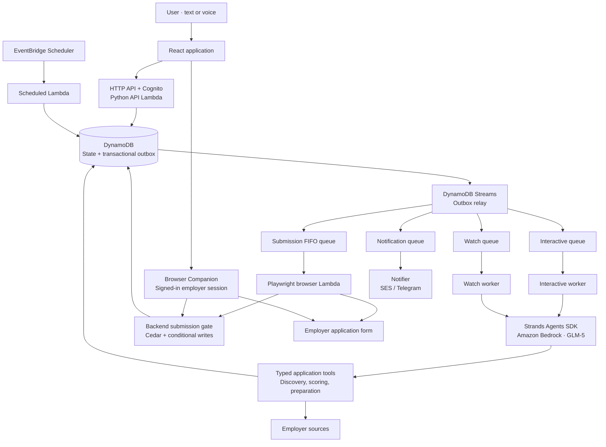

# Career Agent

**An AWS application for job discovery, evidence-based matching, and policy-controlled application automation.**

Career Agent connects the steps that usually live in separate tools: finding openings, comparing them with a resume, preparing answers, submitting through a supported employer form, and tracking the outcome. Users interact through text or voice and can create recurring watches with explicit automation preferences.

[Live application](https://frg3ei3pc0.execute-api.us-east-1.amazonaws.com) · [Architecture](docs/ARCHITECTURE.md) · [Development and deployment](docs/DEVELOPMENT.md) · [Browser Companion](browser-companion/README.md)

[](https://github.com/souvikDevloper/career-agent/actions/workflows/ci-cd.yml)
[](LICENSE)

## Contents

- [Purpose and capabilities](#purpose-and-capabilities)
- [System overview](#system-overview)
- [Application lifecycle](#application-lifecycle)
- [Discovery and connector coverage](#discovery-and-connector-coverage)
- [Using the application](#using-the-application)
- [Engineering decisions](#engineering-decisions)
- [Repository structure](#repository-structure)
- [Validation and operational limits](#validation-and-operational-limits)
- [Documentation](#documentation)

## Purpose and capabilities

Job applications require repeated searches, repeated form entry, and careful tracking of what was sent. Automation adds another problem: a generated answer, a queued task, and an accepted application are three different things.

Career Agent keeps these stages explicit. A match includes its scoring evidence. An application packet records the information prepared for the employer. Submission follows backend authorization, and the application timeline records the observed result.

| Capability | Implementation |
| --- | --- |
| Job discovery | Configured employer feeds and direct Google and Microsoft careers adapters; company, role, location, and work-mode filters. |
| Explained matching | A versioned 0–100 rubric combining skills, experience, responsibilities, and preferences, with resume quote verification and separate eligibility checks. |
| Application preparation | Versioned packets built from resume facts and reusable profile answers; missing required information becomes an explicit question. |
| Recurring watches | Scheduled searches with a configurable interval, a minimum of 15 minutes, and separate background execution. |
| Controlled automation | Review mode, auto-apply above 80, or auto-apply to eligible roles, subject to a scoped mandate, daily cap, cooldown, and current policy checks. |
| Browser execution | A cloud Playwright worker for supported public forms and a Browser Companion for forms in the user's signed-in browser. |
| Voice and tool access | Amazon Transcribe and Polly for voice; Strands Agents SDK for tool orchestration; an authenticated MCP interface to the shared tool registry. |
| Outcome tracking | Application events, confirmation evidence, notifications, and follow-up tasks; uncertain results are reconciled before another attempt. |

## System overview

The frontend uses React and TypeScript. Python Lambda functions own the application domain, orchestration, and authorization. DynamoDB stores workflow state and transactional outbox records; SQS separates interactive work, recurring watches, browser submissions, and notifications.



The submission-gate arrows represent authorization requests: the browser interacts with the employer after authorization. The cloud worker calls a dedicated gate Lambda; the companion uses scoped browser-session API routes. The [architecture guide](docs/ARCHITECTURE.md) expands these boundaries and recovery paths.

**Model configuration:** the project deployment uses GLM-5 on Amazon Bedrock through its OpenAI-compatible endpoint. Strands remains the agent SDK. In this route, `ModelProvider=openai` selects the client protocol; it does not mean the model is hosted by OpenAI. The repository also supports the native Bedrock adapter. See [model configuration](docs/DEVELOPMENT.md#model-configuration).

## Application lifecycle

1. **Discover.** Retrieve openings from supported sources and preserve source status. A source failure is different from a successful search with no matches.
2. **Evaluate.** Apply preferences and eligibility checks, then calculate an explained fit score. A high score alone does not authorize submission.
3. **Prepare.** Build a packet from the selected resume version, profile facts, saved answers, and the form information available to the connector.
4. **Authorize.** Evaluate the user's review or automation mode. Explicit approvals bind to a packet hash; automatic authorization also requires an active mandate and the relevant eligibility checks.
5. **Execute.** Select the route for the concrete posting. Fill a supported public form in the cloud or use the connected browser for an authenticated employer portal.
6. **Confirm.** Record employer confirmation when observed. If the browser may have submitted but cannot establish the outcome, preserve `OutcomeUnknown` and reconcile instead of blindly submitting again.

Cloud discovery and preparation can run while the user is offline. The companion route requires the connected browser to remain open and the employer session to be usable. Login, MFA, CAPTCHA, unsupported controls, and genuinely missing answers can still require user attention.

## Discovery and connector coverage

Discovery coverage and submission support are separate capabilities. A connector can discover a posting whose application form needs a different executor.

| Source family | Examples in the configured catalog | Discovery approach |
| --- | --- | --- |
| Amazon Jobs | Amazon | Public search, details, and country filters |
| Google Careers | Google, YouTube | Direct search with role, location, and seniority handling |
| Microsoft Careers | Microsoft | Direct search, pagination, details, and entry-level facets |
| Workday | Adobe, NVIDIA, PayPal, Salesforce, Autodesk, HP | Configured tenant and career-site feeds |
| Oracle HCM | JPMorgan Chase | Configured tenant/site search |
| Greenhouse | Stripe, Databricks, MongoDB, Elastic, and other configured boards | Public board listings and job details |
| Lever | Match Group | Public postings |
| Ashby | Linear, PostHog | Public job boards |
| Adzuna | Configuration-dependent | Optional aggregator; requires credentials and configured boards |
| Test portal | Fictional Northwind Labs | Controlled discovery, form submission, and reconciliation fixture |

The fictional employer is disabled by default. Enabling or explicitly provisioning a test fixture does not establish that a real employer accepted an application.

Submission routing is implemented in [submission.py](backend/src/career_agent/submission.py):

- **Cloud browser:** the test portal and qualifying public forms hosted on `job-boards.greenhouse.io`.
- **Local browser:** supported authenticated portals and external application destinations, using the Browser Companion.
- **Manual handoff:** destinations without a supported automated route.

These routes describe implementation support, not a guarantee that every employer's current form will succeed. Source availability, form changes, and employer session requirements remain operational dependencies. See the dated [search reliability notes](docs/search-reliability.md).

## Using the application

1. Open the [application](https://frg3ei3pc0.execute-api.us-east-1.amazonaws.com), sign in, and review your resume and extracted facts in **Profile**. The example workspace is available for exploration.
2. Save reusable screening answers and preferences. Accurate employment dates, education details, and authorization answers improve preparation.
3. Choose an automation mode in **Settings**, configure a daily cap, and grant the intended mandate.
4. Install the [Browser Companion](browser-companion/README.md), connect the browser in Settings, and sign in to the relevant employer accounts.
5. Search or create a watch through text or voice. For example: “Watch for Microsoft software engineering internships in India every 30 minutes.”
6. Follow the application's timeline and notification status. Confirmed submissions, approval requests, and browser attention requests are distinct events.

An unpacked extension must be reloaded after its files change; deploying the backend does not update an already-loaded extension. Employer confirmation emails originate from the employer. Career Agent's own notifications do not imply access to a user's Gmail inbox.

## Engineering decisions

| Decision | Reason |
| --- | --- |
| Backend authorization | Cedar and conditional database writes enforce submission rules independently of model output. |
| Versioned application packets | The system can identify the exact content approved for a particular attempt. |
| Transactional outbox | Workflow state and the intent to dispatch work are committed together, reducing lost-work windows. |
| Separate worker queues | Watch backlogs have their own execution lane instead of occupying the interactive queue. |
| Explicit uncertain outcomes | A timeout after an external write is not sufficient evidence that the write failed. |
| Two browser executors | Public forms and authenticated sessions require different access and execution models. |
| Evidence-aware matching | Resume quotes are checked against source text; a match score is an application rubric, not an employer ATS score or interview probability. |

## Repository structure

```text
backend/
  src/career_agent/
    agent.py              Strands runtime and typed tool registry
    discovery.py          Search, normalization, filtering, and source status
    scoring.py            Fit rubric, evidence checks, and eligibility
    applying.py           Application packet preparation and grounding
    submission.py         Per-posting executor selection
    workflow.py           State transitions, approvals, quotas, and attempt control
    policy.py             Cedar policy integration
    services.py           Application services used by handlers and tools
    sources/              Employer-specific discovery adapters
    handlers/             API, workers, relay, scheduler, gate, and notifications
    mcp.py / oauth.py      Authenticated external tool access
worker-browser/           Node.js and Playwright cloud executor
browser-companion/        Chrome extension and browser-flow regressions
frontend/                 React and TypeScript application
policies/                 Cedar authorization policies
scripts/                  Bootstrap, build, and deployment smoke checks
infra/                    Deployment bootstrap infrastructure
template.yaml             AWS SAM application infrastructure
docs/                     Architecture, development, demo, and coverage guides
```

## Validation and operational limits

[CI](https://github.com/souvikDevloper/career-agent/actions/workflows/ci-cd.yml) runs backend lint and tests, Cedar/Strands import checks, browser-worker tests, companion regressions, and frontend type checking and builds. Changes on `main` proceed to AWS deployment and a smoke test after those checks pass.

The browser suites use real Chromium with controlled fixtures. They verify supported behaviors without claiming universal live-employer coverage. A successful build or prepared packet is not proof of a completed application.

The deployment uses serverless compute with model-call allowances, queue concurrency limits, lifecycle cleanup, and budget alerts. Actual costs depend on model usage and AWS configuration; budget alerts are notifications, not a hard spending cap. Email delivery is constrained by SES sandbox status until production access is granted. CloudFront is optional; the alternative serves the private frontend bucket through the API's web handler.

## Documentation

| Guide | Contents |
| --- | --- |
| [Architecture](docs/ARCHITECTURE.md) | Components, search pipeline, submission sequence, states, persistence, trust boundaries, and failure handling |
| [Development and deployment](docs/DEVELOPMENT.md) | Prerequisites, local checks, model configuration, deployment, and operational verification |
| [Browser Companion](browser-companion/README.md) | Installation, pairing, supported behavior, and extension-specific tests |
| [Search reliability](docs/search-reliability.md) | Dated source checks and coverage limitations |
| [Demo script](docs/DEMO_SCRIPT.md) | Demonstration walkthrough |
| [Submission notes](docs/SUBMISSION.md) | Hackathon submission material |

## Development attribution

Developed by Souvik Ghosh and the Career Agent team with AI-assisted implementation, debugging, and documentation. The team is responsible for reviewing the code and validating the product's behavior.

## License

[MIT](LICENSE).
