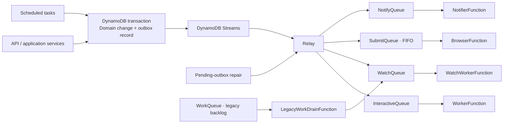
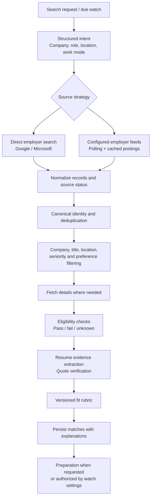
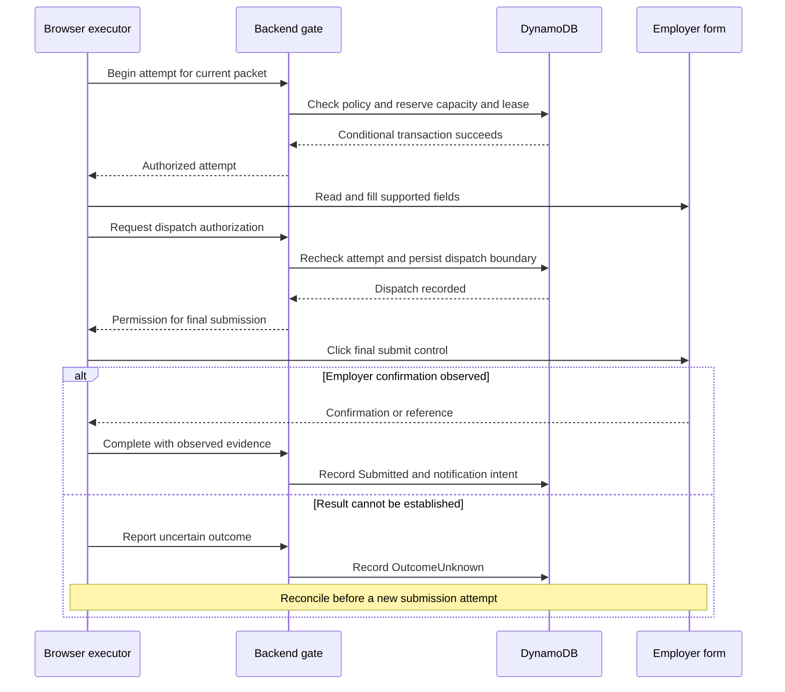
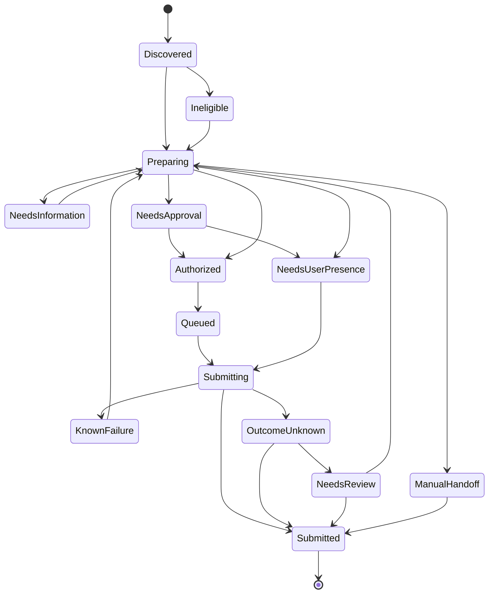

# Architecture

[README](../README.md) · [Development and deployment](DEVELOPMENT.md) · [Browser Companion](../browser-companion/README.md)

Career Agent separates conversational reasoning from durable workflow state and permission to act. The model can choose among typed tools; application code determines whether a transition or submission is allowed.

This guide describes the repository implementation. Resource definitions in [template.yaml](../template.yaml), transitions in [workflow.py](../backend/src/career_agent/workflow.py), and policies in [career_agent.cedar](../policies/career_agent.cedar) are the executable sources of truth.

## Contents

1. [System boundaries](#1-system-boundaries)
2. [Work dispatch and workload isolation](#2-work-dispatch-and-workload-isolation)
3. [Discovery and matching](#3-discovery-and-matching)
4. [Agent runtime and model access](#4-agent-runtime-and-model-access)
5. [Packets and authorization](#5-packets-and-authorization)
6. [Browser execution](#6-browser-execution)
7. [Application state model](#7-application-state-model)
8. [Persistence and ownership](#8-persistence-and-ownership)
9. [API and credential boundaries](#9-api-and-credential-boundaries)
10. [Failure handling](#10-failure-handling)
11. [Verification](#11-verification)

## 1. System boundaries

| Layer | Components | Responsibility |
| --- | --- | --- |
| User experience | React, TypeScript, Browser Companion | Profile editing, search, approval, timelines, and authenticated form execution |
| Identity and API | Cognito, HTTP API, Python API Lambda | Authenticate requests, bind them to a user, validate inputs, and invoke services |
| Reasoning | Strands Agents SDK, configurable model adapter | Select typed tools and generate grounded explanations |
| Domain | Discovery, scoring, applying, services, workflow, Cedar | Normalize jobs, prepare packets, enforce transitions, and authorize attempts |
| Persistence | DynamoDB, S3 | Store records, versions, outbox intent, documents, and execution evidence |
| Delivery | DynamoDB Streams, relay, SQS, EventBridge Scheduler | Dispatch durable work and trigger due watches, reminders, and repair |
| Execution | Worker Lambdas, Playwright Lambda, browser extension | Run queued tasks and interact with supported forms |
| Operations | CloudWatch, dead-letter queues, SNS, AWS Budgets | Surface delivery failures, inspect execution, and monitor spending |

The private frontend bucket has two deployment options: CloudFront with origin access control, or an API Gateway web route backed by `WebFunction`. The latter is the project's account-constrained deployment path; CloudFront is an infrastructure option, not a prerequisite for using the app.

## 2. Work dispatch and workload isolation

Interactive and watch workers share the worker implementation but consume different queues. The legacy work-drain function handles the earlier queue during migration and moves autonomous work into the watch lane. It is a compatibility path, not the destination for new interactive requests.

The current template limits each interactive, watch, and legacy-drain event-source mapping to two concurrent invocations. These limits reduce competition in a low-concurrency account; they do not reserve capacity for the API or guarantee latency. Other functions still share account-level capacity.

The monitor schedule runs every five minutes. User watches have their own due times and a minimum requested interval of 15 minutes; a scheduler tick is not a promise of exact execution time. Queue backlog and source polling intervals can introduce additional delay. Example-workspace cleanup runs every six hours.

### Delivery semantics

A state transition and its outbox intent can commit in one DynamoDB transaction. The relay sends the outbox payload to SQS, then marks it dispatched. If delivery succeeds but the acknowledgement or record update fails, the message may be sent again.

Delivery is **at least once**. Conditional writes, canonical application keys, leases, and attempt state provide domain-level duplicate protection. FIFO deduplication helps the submission lane but does not make a third-party browser interaction transactional.

Pending outbox records are repairable through scheduled relay repair. Workers report failed batch items so a failure does not require treating every successfully processed message as failed.

## 3. Discovery and matching

[discovery.py](../backend/src/career_agent/discovery.py) owns normalization, filtering, deduplication, hydration, and source status. Employer adapters live in [sources](../backend/src/career_agent/sources). The diagram shows logical stages; detail hydration and filtering can be repeated as more information becomes available.

Search results must be interpreted with their source evidence. “No matching records were returned” is narrower than “this company has no openings.” Cached data, incomplete responses, unconfigured sources, and source errors must not be represented as an exhaustive live search.

### Eligibility and scoring

[scoring.py](../backend/src/career_agent/scoring.py) separates hard filters from the fit score. Missing evidence can leave a requirement unknown; a score does not resolve an unknown requirement or grant submission permission.

The current `fit-rubric/2.0` weights are:

| Dimension | Maximum |
| --- | ---: |
| Required skills | 40 |
| Project and experience evidence | 30 |
| Role responsibilities | 20 |
| User preferences | 10 |
| **Total** | **100** |

The result is Career Agent's rubric, not an employer ATS score or a prediction of interview success. Quote verification checks whether supporting text occurs in the supplied resume. It does not independently authenticate the applicant's credentials.

## 4. Agent runtime and model access

[agent.py](../backend/src/career_agent/agent.py) creates a Strands agent around a fixed registry of typed application tools. Tools expose search, watch management, saved profile answers, preparation, and status through services bound to the authenticated user.

| Configuration | Strands adapter | Endpoint selection |
| --- | --- | --- |
| `ModelProvider=bedrock` | `BedrockModel` | Native Bedrock APIs and `ModelId` |
| `ModelProvider=openai` | `OpenAIModel` | OpenAI-compatible `ModelApiBase` and `FallbackModelId` |
| `ModelProvider=anthropic` | `AnthropicModel` | Configured compatible endpoint and model |

The project's deployment uses **GLM-5 on Amazon Bedrock** through `https://bedrock-mantle.us-east-1.api.aws/v1`, with model identifier `zai.glm-5`. The historical configuration name `FallbackModelId` is used by this adapter even when the endpoint is Bedrock itself. It does not imply an off-AWS fallback.

Tool arguments pass through domain validation and authorization. The model does not receive an arbitrary shell or unrestricted fetch tool. Fallback paths report the mode used; heuristic matching should not be described as a model-generated evaluation.

Text and finalized voice input use the application tool layer. Transcribe supplies speech recognition and Polly supplies spoken output. A partial transcript is not an action request.

## 5. Packets and authorization

Preparation combines the selected resume version, profile facts, saved screening answers, and available employer-form information. [applying.py](../backend/src/career_agent/applying.py) builds the packet and applies grounding checks, including checks on quoted evidence and generated numerical claims.

A packet has a version and content hash. Approval records refer to the current packet rather than granting permission to send arbitrary later edits. New answers or a revised resume can require re-preparation and a fresh authorization decision.

| Mode | Submission condition |
| --- | --- |
| `review` | Current packet has the required explicit approval |
| `auto_above_80` | Score is strictly greater than 80, automation eligibility passes, and the current mandate permits the action |
| `auto_eligible` | Automation eligibility passes and the current mandate permits the action |

All routes remain subject to the relevant packet checks, ownership, allowed destination, mandate scope and expiry, daily capacity, cooldown, and current policy evaluation. Saving a preference is not equivalent to granting an active mandate.

Cedar evaluates policy. DynamoDB conditions protect the corresponding state changes and capacity reservation against concurrent requests. Both are needed: a policy decision alone cannot atomically reserve the last daily application slot.

## 6. Browser execution

The route belongs to the individual posting, not merely to its discovery connector. [submission.py](../backend/src/career_agent/submission.py) selects `cloud_browser`, `local_browser`, or `manual` according to the supported destination.

### Shared submission protocol

The diagram summarizes the shared domain protocol. Transport and evidence differ by executor: the cloud worker invokes the gate Lambda and can store screenshots in S3; the companion uses capability-scoped API endpoints and reports browser observations.

Recording dispatch before clicking creates a conservative window: a browser can fail after dispatch was recorded but before the click occurred. The backend cannot safely infer failure from that interruption. It preserves uncertainty rather than risking a second application.

### Cloud browser

The Node.js worker uses Playwright with Chromium for the controlled test portal and qualifying public Greenhouse-hosted forms. It runs independently of the API and obtains authorization through the gate. It has no direct DynamoDB write access; workflow mutations remain behind the gate.

### Browser Companion

The extension uses the existing employer session without copying passwords or cookies into the backend. Pairing creates a scoped runner capability with a maximum seven-day lifetime. Application-specific sessions are short-lived and bound to the intended application context.

The runner polls for eligible work while the browser is available. Its content script handles recognized controls, resume uploads, repeated work and education records, and navigation. It preserves user-entered fields and pauses for missing information or employer challenges. Reloading the extension is necessary after a local extension update.

Supported patterns are tested with local employer-shaped fixtures. A fixture passing does not establish compatibility with every live page, and identifying a submit button does not establish employer acceptance.

## 7. Application state model

This is a condensed operational view. The executable transition table also includes pause, withdrawal, re-preparation, and pre-dispatch recovery paths.

Submission state and recruitment stage are distinct. A submitted application can later receive an assessment or interview update without repeating submission. Manually reported completion also has a different provenance from browser-observed confirmation; consumers must retain that distinction.

## 8. Persistence and ownership

DynamoDB uses a single-table design. The API derives the user identity from authentication rather than trusting a user identifier supplied to an agent tool.

| Record family | Purpose |
| --- | --- |
| Profile, resume, and settings | Applicant data, saved answers, preferences, mandate, and notification settings |
| Jobs and source metadata | Normalized postings, source status, polling state, and cached details |
| Matches and watches | Scores, search criteria, watch due times, and automation preferences |
| Applications and canonical keys | Lifecycle records and duplicate-application protection |
| Packet versions and approvals | Prepared content and authorization tied to that content |
| Attempts, leases, and usage | Submission ownership, dispatch state, and quota accounting |
| Outbox records | Durable work and notification intent |
| Events and tasks | Timeline, follow-up work, and outcome history |

User-owned workflow rows use the `USER#<id>` partition convention. Applications use `APP#<id>` sort keys; `APPKEY#<canonical>` records protect canonical identity. Outbox records use separate `OUTBOX#<id>` partitions and a pending-work index for repair.

S3 holds binary objects such as resumes and cloud-browser evidence. Lifecycle cleanup reduces retention; database TTL is cleanup, not the authorization clock. Mandate and session expiry must be evaluated when an action is attempted.

## 9. API and credential boundaries

Cognito JWTs protect application API requests. Browser sessions use scoped capabilities so an employer tab does not need the user's full application login token.

`POST /api/mcp` exposes tools from the shared registry. The OAuth implementation includes discovery, dynamic client registration, PKCE S256, and single-use authorization-code handling. The external MCP surface excludes `approve_application`; an external model's tool call does not supply the application's evidence of explicit user approval.

This is a custom OAuth implementation, not a claim of third-party protocol certification. Client interoperability and token validation should be tested against the intended deployment.

Internal execution uses IAM and application-scoped secrets. Model API keys belong in SSM SecureString parameters, not frontend configuration or repository files. GitHub Actions assumes its deployment role through OIDC instead of storing long-lived AWS deployment keys.

## 10. Failure handling

| Failure | Expected response | Practical limit |
| --- | --- | --- |
| Source unavailable or throttled | Preserve source status and distinguish cached results | Search may be incomplete |
| Model unavailable or allowance exhausted | Expose failure or a labelled fallback | Heuristics are not equivalent model results |
| Unknown required answer | Pause for information and re-prepare | Profile data cannot resolve every employer question |
| Approval no longer matches packet | Require a current authorization decision | One approval does not cover arbitrary edits |
| Duplicate queue delivery | Conditional state and attempt checks reject repeated work | SQS remains at least once |
| Worker lease expires | Validate attempt ownership before further actions | Earlier permission does not remain valid indefinitely |
| Browser stops after dispatch | Preserve uncertainty and reconcile | Some employers have no confirmation lookup |
| Watch backlog grows | Keep watch and interactive queues separate | Account-wide concurrency can still affect both |
| Notification fails | Retry and expose dead-letter failures | Acceptance and notification delivery are separate outcomes |

SES sandbox restrictions apply until production access is granted. Telegram requires configuration. Employer emails are not automatically ingested from Gmail; reply processing depends on a configured inbound path.

Model-call allowances, queue limits, lifecycle policies, and budget notifications constrain resource use. They do not promise a fixed bill or a hard dollar cap.

## 11. Verification

CI runs backend lint/tests and SDK import checks; real-Chromium browser-worker and companion regressions; and frontend type checking and builds. On `main`, deployment follows successful checks, then runs [smoke.py](../scripts/smoke.py).

A domain test proves a transition rule, a browser fixture proves a supported interaction, and an employer confirmation supports a submission result. These are different levels of verification and should remain labelled as such.
